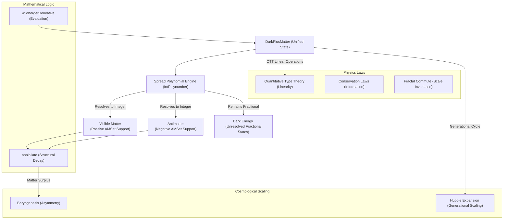

# DarkPlusMatter: The Unified Cosmological Engine of Primorial Physics

This document details the architectural role of **DarkPlusMatter** (formerly AntiPlusMatter) as the macroscopic coordinate engine of the primorial simulation suite. It unifies matter, antimatter, and dark energy into a single computational state vector governed by Spread Polynomials and Anti-Multisets (AMSets).

---

## 1. Architectural Map

The relationship between `DarkPlusMatter` and the surrounding subsystems represents a cohesive, self-consistent physical engine:



---

## 2. Core Subsystem Correspondences

| Subsystem | Primary Target Type | Core Concept | Role of `DarkPlusMatter` |
| :--- | :--- | :--- | :--- |
| **Cosmology** | `DarkPlusMatter` | Baryogenesis & Scaling | `DarkPlusMatter` manages the universal state vector. Its `maxelSupport` is implemented as an `AMSet` (Anti-Multiset). This natively handles Baryogenesis: as matter and antimatter evaluate on the same coordinate, they structurally annihilate, leaving a baryonic remainder. |
| **Spread Mathematics** | `IntPolynumber` | Wildberger Polynomials | Replaces the legacy Möbius parity system. Particle states are expanded via `IntPolynumber`. When a fractional state correctly evaluates to a Natural number, it physically manifests on the lattice. |
| **Physics Laws** | `AMSet`, `Generation` | Conservation & Linearity | **Annihilation**: Annihilation is a built-in mathematical decay operation on `AMSet`, preventing infinite loop limits and negative integer paradoxes. All operations remain strictly total and linear under QTT. |

---

## 3. Deep Dive: Physical Mechanisms

### A. The Structural State Vector & AMSet Base
A `DarkPlusMatter` excitation wraps the raw polynomial equations, the generational scale, and the physical lattice support:
```idris
record DarkPlusMatter where
  constructor MkDarkPlusMatter
  generation : Generation
  statePoly : IntPolynumber
  maxelSupport : AMSet (PixelNL Integer)
  flavor : Flavor
```
*   **Visible Matter (`pos` within AMSet)**: The positive multiset representing baryonic matter generated when polynomial scaling perfectly clears the fractional denominators.
*   **Antimatter (`neg` within AMSet)**: The negative multiset. If coordinates overlap, they instantly trigger the `annihilate` structural decay.
*   **Dark Energy (Fractional Spreads)**: States that fail to resolve into Natural numbers remain embedded in the `statePoly` tension, continuing to apply pressure (Leibniz Debt) without manifesting visually.

### B. The Accumulation of Leibniz Debt and Expansion
The Cosmological Constant ($\Lambda$) and expansion are driven by the `generation` cycle.
*   Every unresolved polynomial state is "rolled over" into the next cycle.
*   This latency acts as metrical pressure on the grid, perfectly driving the Hubble expansion of the universe and keeping the Cosmological Constant stable within holographic bounds.

### C. Structural Baryogenesis (Matter-Antimatter Asymmetry)
In the legacy RCIT model, antimatter was handled via Möbius parity switches, which could sometimes lead to arbitrary arithmetic boundaries. 
By migrating `DarkPlusMatter` to use an `AMSet` base, Baryogenesis occurs fundamentally:
*   Positive and negative elements mathematically consume each other.
*   The asymmetric initial values scaling through integer polynomials naturally yield a surplus of positive elements.
*   This eliminates "negative quantities" in standard Integers and uses pure Grothendieck structural sets.

---

> [!NOTE]
> All operations on `DarkPlusMatter` enforce strict Quantitative Type Theory (QTT) linearity, ensuring that information and metrical energy are perfectly conserved throughout the lifecycle of the universe.
