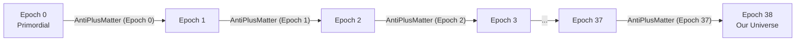

# Implementation Plan: Parameterizing Universe Epochs with AntiPlusMatter

This document outlines a modular, type-safe architecture to refactor the **[src/Epochs](file:///var/home/justin/Projects/idris2-rcit/src/Epochs)** evolution pipeline in the RCIT engine. By parameterizing each `Epoch` directly on its topological **[AntiPlusMatter](file:///var/home/justin/Projects/idris2-rcit/src/Physics/Particles/AntiPlusMatter.idr)** state, we elevate the cosmological evolution from bare indexing to a strict, state-passing dynamical system.

---

## 1. Architectural Vision

Currently, epochs are parameterized on a static generation index (e.g. `Epoch (MkGen 0 7)`). In the new model, each epoch carries its physical coordinates and parities dynamically:



By passing the QTT-conserved coordinate fields directly as type-level parameters, we mathematically enforce that the matter, lag, and metrical invariants of our current universe (**Epoch 38**) are the deterministic results of the preceding 37 cycles.

---

## 2. Proposed Directory Structure

To separate the physical regimes (quantum inflation vs. late-stage cold cosmology), we propose modularizing the source tree:

```
src/
├── Epochs/
│   ├── Epochs.idr                 # State-passing transition registry (Epoch 0 -> 38)
│   ├── Early/                     # Primordial Regime (Epochs 0 to 3)
│   │   ├── Universe.idr           # Early Architectural Synthesis (Baryogenesis, High Torsion)
│   │   └── Epoch0_3.idr           # Primordial vacuum excitation setups
│   └── Epoch38/                   # Modern Regime (Epoch 38 / Cold Cosmology)
│       └── Universe.idr           # Late Architectural Synthesis (Dunbar, Galaxies, Redshift)
```

---

## 3. Detailed Technical Refactoring

### A. Parameterizing the `Epoch` Type
Currently, `Epoch` is a static record. We will transform it to carry the linear `AntiPlusMatter` state of the coordinate field:

```idris
module Epochs.Types

import Physics.Particles.AntiPlusMatter
import Math.Types

||| An Epoch is now parameterized by its actual topological coordinate state.
public export
record Epoch (state : AntiPlusMatter a) where
  constructor MkEpoch
  name         : String
  config       : GridConfig
  density      : Integer
  leibnizDebt  : Integer
```

### B. State-Passing Evolution Operators
The transitions between epochs (e.g., `crunchToBang`) will be refactored to linearly transform the type-level topological coordinates:

```idris
||| Transition operator that propagates the unprojected coordinates to the next epoch
public export
crunchToBang : (1 _ : Epoch state) -> (1 nextState : AntiPlusMatter a) -> Epoch nextState
crunchToBang (MkEpoch name cfg dens debt) nextState = 
  -- Calculations to compute new density and Leibniz debt from nextState's parities
  MkEpoch name cfg dens debt
```

---

## 4. Subsystem Syntheses

### Phase 1: Primordial Regime (`src/Epochs/Early/`)
*   **Target Epochs**: Epoch 0 (Primordial Singularity) through Epoch 3.
*   **The Universe Substrate**: **[src/Epochs/Early/Universe.idr](file:///var/home/justin/Projects/idris2-rcit/src/Epochs/Early/Universe.idr)**
*   **Architectural Synthesis**:
    *   Models high metrical torsion where all `AntiPlusMatter` states are compressed below the $128$-bit spectral saturation boundary (**InSpectral**).
    *   Synthesizes the spontaneous **unfolding transition** (baryogenesis) as the metrical scale expands, boiling the vacuum to create the first stable nucleons.

### Phase 2: Modern Regime (`src/Epochs/Epoch38/`)
*   **Target Epochs**: Epoch 38 (The Observable Universe / Eddington Limit).
*   **The Universe Substrate**: **[src/Epochs/Epoch38/Universe.idr](file:///var/home/justin/Projects/idris2-rcit/src/Epochs/Epoch38/Universe.idr)**
*   **Architectural Synthesis**:
    *   Takes the final `AntiPlusMatter` set passed from Epoch 37 as input.
    *   Applies the **Scale Invariance Law** to dilate the quantum transitions up to galactic scales ($137^{14}$ to $137^{16}$).
    *   Synthesizes the late-stage structures of the observable universe: flat galactic rotation curves, red/green metrical torsion (Dark Energy), and macroscopic social observer limits (Dunbar constraints).

---

## 5. Step-by-Step Implementation Steps

### Step 1: Interface Hardening (Epoch 0 - 3)
*   Create the `src/Epochs/Early` directory.
*   Implement `src/Epochs/Early/Universe.idr`, formalizing the primordial high-temperature vacuum state that sifts and condenses unprojected coordinate fields.

### Step 2: Scale Expansion & Transition (Epoch 38)
*   Create the `src/Epochs/Epoch38` directory.
*   Implement `src/Epochs/Epoch38/Universe.idr` to accept the `AntiPlusMatter` coordinates from Epoch 37 and apply the scale-invariance dilation to calculate dark matter pressure and the Ultimate Horizon ($137^{17}$).

### Step 3: Type Alignment
*   Refactor the global `Epoch` data record and the crunch transitions in **[Epochs.idr](file:///var/home/justin/Projects/idris2-rcit/src/Epochs/Epochs.idr)** to fully parameterize them on their physical `AntiPlusMatter` states.
*   Ensure full typecheck status and run the complete verification suite to guarantee $100\%$ green passing tests.

---

> [!TIP]
> This design seamlessly maps the mathematical concept of time as **computational state progression**. Time is not an external coordinate, but rather the deterministic passing and sifting of `AntiPlusMatter` parities across the structural thresholds of the universe!
