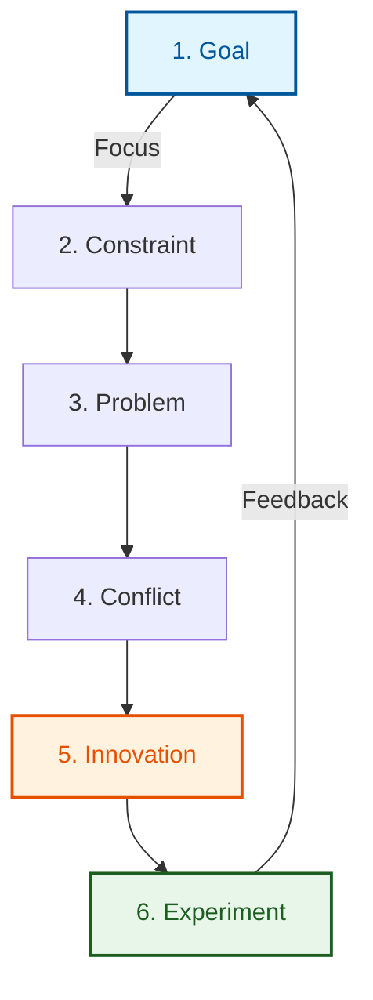
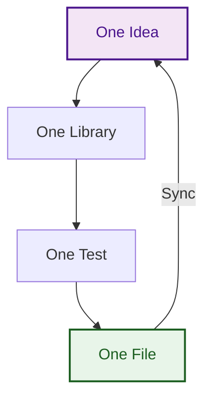

# Knowledge Management: Project Workflow

This document defines the mandatory workflow for all contributors and AI agents interacting with the project. The goal is to establish a "virtuous circle" of knowledge grooming, ensuring each session improves the structural quality and accessibility of the repository's intellectual capital.

## Core Directives

1.  **Entry Point**: Always start by reading `/var/home/justin/Projects/Library/Knowledge_Base/Index.md`. This is your primary map for the project's current state and stabilized findings.
2.  **Continuous Update**: Store all new insights, architectural decisions, and logical derivations in the `/var/home/justin/Projects/Library/Knowledge_Base` directory during the session.
3.  **Raw Ingestion**: Any primary source material, transcripts, or data downloaded from the internet must be initially saved to `/var/home/justin/Projects/Library/Raw`.
4.  **Wiki Transformation**: Convert primary materials from `Raw` into structured, navigable, and summarized Markdown files within `/var/home/justin/Projects/Library/Wiki`.
5.  **Technical Reference**: Use the `/var/home/justin/Projects/Library/Src` directory as the \"Gold Standard\" for Idris 2 programming patterns. All new code must be benchmarked against these examples.
6.  **Refinement & Synthesis**: Create high-level summaries and "stabilized" knowledge in the `Knowledge_Base` that builds upon and synthesizes the detailed content found in the `Wiki`.

## The Antifragile Workflow: Find and Focus

To ensure continuous improvement and goal-oriented progress, the project follows a dual-loop system based on the **"One Thing: Find and Focus"** methodology. We treat the "One Thing" as the primary element (the first item) in a prioritized **Multiset** of tasks.

### Loop A: The Strategy Loop (Find & Focus)
In each session, we identify and focus on the single most critical path. We loop through the following stages head-to-tail until the Goal is satisfied:
1.  **Goal**: Select one primary high-level objective from the `Knowledge_Base`.
2.  **Constraint**: Identify the primary bottleneck preventing that Goal.
3.  **Problem**: Pinpoint the underlying problem causing the Constraint.
4.  **Conflict**: Identify the logical or technical conflicts contributing to the Problem.
5.  **Innovation**: Propose a "win-win" candidate solution (Innovation) to resolve the Conflict.
6.  **Experiment**: Select **One Experiment** that will verify the Innovation, then return to **Step 1 (Goal)** to evaluate the new state.

### Loop B: The Delivery Loop (The Helix)
Once an Experiment is selected, we transition to the delivery phase. This is a recursive helix of incremental, verified progress:
- **One Idea**: Distill the experiment into a single, clear hypothesis.
- **One Library**: Focus development within a single Idris 2 project in `/var/home/justin/Projects/Library/Src/`.
- **One Test**: Implement a single literate test in the project's test suite.
- **One File**: Successfully synchronise one verified `.qmd` file to the `/var/home/justin/Projects/Book` directory.

This approach ensures that stress (failures in the Delivery Loop) provides immediate feedback to the Strategy Loop, making the entire knowledge base antifragile.

## Project Source Code & Documentation

The project's source code is organised into discrete sub-folders under the root `Projects` directory. Each project follows these standards:

1.  **Naming & Build System**: Projects use descriptive names (e.g., `idris2-Multiset-Basic`, `idris2-Singletons-Pixels-and-Maxels`) and are managed as **pack libraries** (look for `pack.toml` and `.ipkg` files).
2.  **Literate Testing**: Each project contains a `[package name]-tests` folder (e.g., `idris2-Multiset-Basic-tests`). These tests are "literate," meaning they contain Markdown explanations and documentation interwoven with the code.
3.  **The Orange Book**: The literate tests and source documentation are automatically compiled into a centralised book form using Quarto. This documentation is aggregated within the **`/var/home/justin/Projects/Book`** directory.
4.  **Reference Documentation**: The rendered book is available in the **`Book/_book/`** directory.
    - **MANDATORY**: You MUST read the corresponding sections in the Orange Book (`Book/Src/[project-name]/`) when working within any project subfolder to understand the narrative context and formal properties of the code. See **[Project Intelligence](./Project_Intelligence.md)** for technical implementation details.

### Documentation Build Pipeline (Centralised)
The "Orange Book" is generated through a centralised automated pipeline that enforces verification across all chapters:
- **Master Command**: Run **`pack test idris2-book`** within the `/var/home/justin/Projects/idris2-book` directory.
- **Step 1: Ecosystem Verification**: The orchestrator iterates through every chapter project and executes its specific `pack test` suite.
- **Step 2: Content Migration**: If a chapter passes, the orchestrator's build logic (**`src/Book.idr`**) migrates literate tests into the centralised **`Book/Src/[project-name]/`** directory as **`.qmd`** files.
- **Step 3: Configuration Update**: The orchestrator auto-generates the **`Book/_quarto.yml`** file based on the master chapter list.
- **Step 4: Quarto Rendering**: The orchestrator finally runs `quarto render` within the **`Book/`** directory to generate the global Orange Book in **`Book/_book/`**.

By following this pipeline, you ensure that future agents have a clear, high-quality, and verified foundation to work from.

## 7. Token Minimization & Structural Efficiency

To optimize performance and reduce context window pressure for AI agents, all contributors must adhere to these "Dense Reference" standards:

- **Modular Lexicons**: Partition the terminology Wiki into sector-specific files (e.g., Math, Physics, Dynamics). Avoid monolithic tables that require excessive token load for single-term lookups.
- **Tabular Documentation**: Prefer tables and high-density bullet points over long paragraphs of prose for technical reference material. See [QTT_Troubleshooting.md](./QTT_Troubleshooting.md) for the target format.
- **Action-Oriented KI Summaries**: Ensure Knowledge Item (KI) metadata summaries contain "Dense Rules" and clear "Read Triggers" (e.g., "Read this when encountering Unsolved Hole or Linearity errors").
- **Reference over Inclusion**: Use file paths and specific line ranges in KI artifacts instead of duplicating large code blocks. This forces agents to read only the specific source lines needed, minimizing redundant context.
- **Boilerplate Templates**: Maintain and utilize a library of dense [Boilerplate Templates](./Golden_Test_Template.md) to streamline repetitive tasks (e.g., creating new test suites) without referencing large, narrative-heavy existing files.
- **Periodic Pruning**: Review and remove intermediate research notes, stale temporary files, and redundant context once findings are stabilized in the Knowledge Base.
