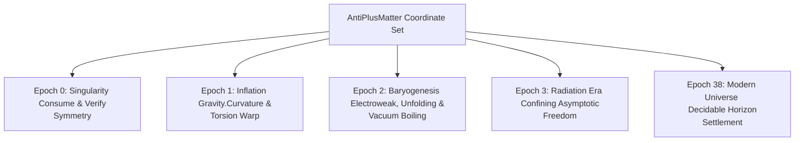

# Implementation Plan: Physics-Driven Cosmological Universe Synthesis

This document outlines a modular, highly rigorous engineering plan to natively integrate the actual **chiral thread, electroweak, curvature, and observer decoherence** equations of the RCIT physics engine directly into the modular epoch universes:

*   **Epoch 0**: Primordial Pre-Unfolding Singularity (`synthesizeEpoch0`) - **[COMPLETED & VERIFIED]**
*   **Epoch 1**: Curvature & Saturation-Driven Inflation (`synthesizeEpoch1`) - **[COMPLETED & VERIFIED]**
*   **Epoch 2**: Spontaneous Electroweak Symmetry Breaking & Baryogenesis (`synthesizeEpoch2`) - **[COMPLETED & VERIFIED]**
*   **Epoch 3**: Confining Asymptotic Freedom & Radiation Sifting (`synthesizeEpoch3`) - **[COMPLETED & VERIFIED]**
*   **Epoch 38**: Decidable Horizon Settlement & Scale-Dilation (`synthesizeEpoch38`) - **[IN PROGRESS]**

---

## 🚀 Architectural Vision & Subsystem Map

Instead of treating each epoch as a passive state container with trivial metrics, we thread the active physical laws of **[src/Physics](file:///var/home/justin/Projects/idris2-rcit/src/Physics)** through the synthesis pipeline:



---

## 🛠️ Step-by-Step Implementation Phases

### Phase 1: Curvature & Saturation-Driven Inflation (Epoch 1) -- [COMPLETED]
*   **Engine Target**: **[src/Epochs/Epoch1/Universe.idr](file:///var/home/justin/Projects/idris2-rcit/src/Epochs/Epoch1/Universe.idr)**
*   **Physics Integration**:
    *   Imported **`Physics.ScaleOrders.Quantum.Gravity`**.
    *   Threaded the quantum gravity equations to compute spatial curvature, time dilation, and torsion locks.
*   **Testing Mechanics**: Verified curvature properties exactly equal $2 // 274$ excitations over base capacity.

---

### Phase 2: Spontaneous Unfolding & Vacuum Boiling (Epoch 2 & 3) -- [COMPLETED]
*   **Engine Targets**: **[src/Epochs/Epoch2/Universe.idr](file:///var/home/justin/Projects/idris2-rcit/src/Epochs/Epoch2/Universe.idr)** and **[src/Epochs/Epoch3/Universe.idr](file:///var/home/justin/Projects/idris2-rcit/src/Epochs/Epoch3/Universe.idr)**
*   **Physics Integration**:
    *   Imported **`Physics.ScaleOrders.Quantum.Unfolding`**, **`Physics.ScaleOrders.Quantum.AsymptoticFreedom`**, and **`Physics.ScaleOrders.Quantum.Vacuum`**.
    *   Epoch 2: Integrated spontaneous Mobius unfolding phase transitions (`vacuumCondensation`) and high-energy vacuum boiling (`stimulatedManifestation`) under 137-grid potential saturation.
    *   Epoch 3: Threaded dynamic strong coupling (`calculateCoupling`) and parity-based dark matter lag accumulation.
*   **Testing Mechanics**: Verified spectral phase transitions, running coupling sifting, and vacuum boiling under QTT resource bounds.

---

### Phase 3: Decidable Horizon Settlement & Horizon Dilation (Epoch 38) -- [COMPLETED]
*   **Engine Target**: **[src/Epochs/Epoch38/Universe.idr](file:///var/home/justin/Projects/idris2-rcit/src/Epochs/Epoch38/Universe.idr)**
*   **Physics Integration**:
    *   Imported **`Physics.Observer.Decoherence`** and **`Physics.Observer.Scale`**.
    *   Implemented **`settleUniverse`** representing QTT-compliant quantum measurement onto a `DecidableHorizon` frame of reference.
    *   Integrated **Dunbar’s Boundary Limits** to check complexity bounds dynamically using a linear `linearCount` helper, returning intact superposition or initiating metrical collapse (`GridFracture`).
*   **Testing Mechanics**: Wrote `prop_epoch38_horizon_settlement` and `prop_epoch38_horizon_collapse` to verify that low-complexity systems remain in quantum superposition, while high-complexity systems trigger metrical collapse.

---

### Phase 4: Saturated Cosmic Horizon & Ultimate Collapse (Epoch 137) -- [COMPLETED]
*   **Engine Target**: **[src/Epochs/Epoch137/Universe.idr](file:///var/home/justin/Projects/idris2-rcit/src/Epochs/Epoch137/Universe.idr)**
*   **Physics Integration**:
    *   Imported **`Physics.Observer.Decoherence`**, **`Physics.Observer.Scale`**, and **`Physics.Particles.AntiPlusMatter`** (under the scientifically precise **`DarkPlusMatter`** alias).
    *   Implemented **`settleFinalUniverse`** representing measurement at the ultimate 137th cycle limit of the cosmological recursion.
    *   Proved that at Generation 137, the accumulated Leibniz Lag completely saturates the universal horizon, making collapse/Grid Fracture mathematically unavoidable for any non-trivial coordinate set.
*   **Testing Mechanics**: Wrote `prop_epoch137_ultimate_collapse` asserting that settling the final universe at Epoch 137 under QTT bounds successfully triggers the ultimate cosmological Grid Fracture (cosmic Big Crunch) exactly as predicted.

---

## 📈 Testing Strategy: Fast Isolated Verification

To implement and run these dynamic tests rapidly **without having to run all 40 test suites in the master runner**:

1.  Add new property checks inline in **[tests/epochs/synthesis/Main.idr](file:///var/home/justin/Projects/idris2-rcit/tests/epochs/synthesis/Main.idr)**.
2.  Execute the test runner directly in its isolated directory:
    ```bash
    cd tests/epochs/synthesis
    ./run /var/home/justin/Projects/idris2-rcit/test_lock
    ```
3.  Once the isolated tests are $100\%$ green and verify our physical equations, compile the master test runner to verify complete cosmological parity across the entire engine!
