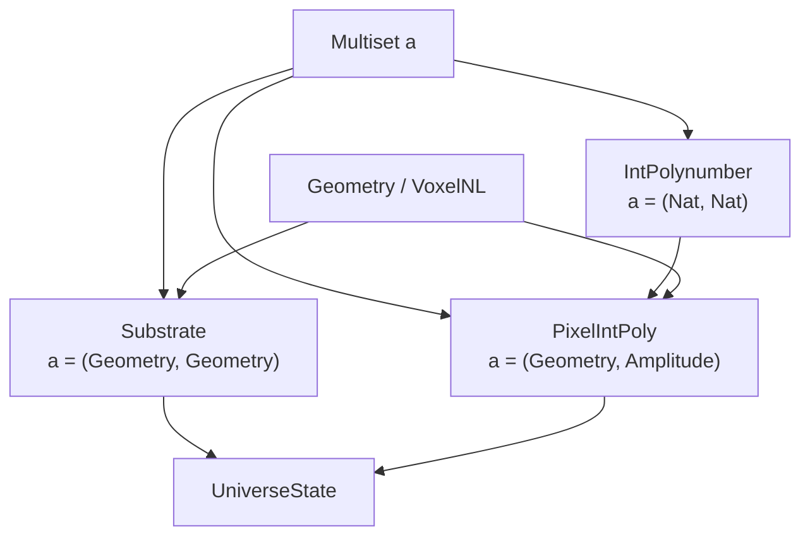

# Mathematical Type Architecture

This document shows the complete type signatures of the Multiset-based mathematical architecture. Every physical concept in the LUniverse is built from these types — there are no special-purpose wrappers or ad-hoc structures.

---

## Layer 1: Linear Foundation (`Math.UnaryMultiset`)

The base data structure. QTT linearity (`1`) ensures every element is consumed exactly once.

```idris
-- The linear multiset: every atom must be accounted for
0 UnaryMultiset : Type -> Type
```

This is the **No-Cloning Theorem** as a type. You cannot duplicate an `Add` node — the compiler forbids it.

### Signed Variant (`Math.SignedUnaryMultiset`)

Matter/Antimatter annihilation as a data structure:

0 SignedUnaryMultiset : Type -> Type

annihilate : Eq a => SignedUnaryMultiset a -> SignedUnaryMultiset a
```

---

## Layer 2: Run-Length Encoded Multiset (`Math.Multiset`)

High-performance representation for large-scale computation. Each element carries an Integer multiplicity (positive = matter, negative = antimatter):

```idris
0 Multiset : Type -> Type

-- Non-empty variant (prevents division-by-zero in spreads)
0 Multiset1 : Type -> Type
```

**This is the engine.** Every physical type alias in the system resolves to `Multiset something`.

---

## Layer 3: Geometry and Coordinates (`Math.Polynumber`, `Math.MaxelNL`)

### Pixel — A 2D Grid Coordinate

```idris
-- Linear version (QTT-enforced)
0 Pixel : Type -> Type
Pixel a = LPair a a

-- Non-linear version (for computation)
0 PixelNL : Type -> Type
```

### Maxel — A Multiset of Pixels (discrete curve or region)

```idris
0 Maxel : Type -> Type
Maxel a = UnaryMultiset (Pixel a)
```

### Geometry — The Metrical Structure

```idris
0 Flexibility : Type

0 Geometry : Type
```

---

## Layer 4: Polynumbers (`Math.Polynumber`, `Math.IntPolynumber`)

### Linear Polynumber (QTT layer)

```idris
0 PowerBasis : Type
PowerBasis = LPair (UnaryMultiset ()) (UnaryMultiset ())   -- (α power, β power)

0 PolyTerm : Type
PolyTerm = LPair PowerBasis (UnaryMultiset ())              -- basis + coefficient

0 Polynumber : Geometry -> Type
Polynumber geom = UnaryMultiset PolyTerm
```

### Integer Polynumber (computation layer)

```idris
IntPolynumber : Type
IntPolynumber = Multiset (Nat, Nat)    -- RLE: (α power, β power) → Integer coefficient
```

### Spread Polynomial

```idris
-- The recurrence: S_n(s) = 2(1-2s)·S_{n-1}(s) - S_{n-2}(s) + 2s
spreadPoly : Nat -> IntPolynumber
```

---

## Layer 5: Rational Trigonometry & Chromogeometry (`Math.Chromogeometry`)

We have stripped away legacy linear types (`Fraction`, `Spread`, `Quadrance` records) in favor of pure integer coordinate math. This completely immunises the engine from floating-point drift and structural decay.

```idris
-- Exact rational integer math. No division truncation!
quadranceNL : Metric -> VoxelNL -> VoxelNL -> Integer
spreadNL    : Metric -> VoxelNL -> VoxelNL -> VoxelNL -> (Integer, Integer)
archimedesNL: Metric -> VoxelNL -> VoxelNL -> VoxelNL -> Integer
```

The Three-Fold Spread Theorem is mathematically guaranteed via exact cross-multiplication over triad geometry.

---

## Layer 6: Physics Type Aliases (`Math.Core`)

Every physical concept is a **type alias** over the Multiset engine. No wrappers.

```idris
-- A coordinate on the integer pixel grid
0 Geometry  : Type
Geometry = VoxelNL

-- A polynomial amplitude at a coordinate
0 Amplitude : Type
Amplitude = IntPolynumber                  -- = Multiset (Nat, Nat)

-- The causal graph (directed edges between coordinates)
0 Substrate : Type
Substrate = Multiset (Geometry, Geometry)  -- = Multiset (VoxelNL, VoxelNL)

-- The quantum state vector (coordinates mapped to amplitudes)
0 PixelIntPoly : Type
PixelIntPoly = Multiset (Geometry, Amplitude)  -- = Multiset (VoxelNL, Multiset (Nat, Nat))

-- The complete universe state
0 UniverseState : Type
```

### The Architecture Diagram



All four physical types are the **same data structure** parameterised differently. An optimisation to `Multiset.idr` automatically improves the causal graph, the state vector, the polynomials, and the spread computations simultaneously.

---

## Layer 7: Twist and Localized Evolution (`Math.Twist` & `Physics.SpreadPolynumber`)

### Twist (Gauge Field Holonomy)

Computes rational gauge field interference directly via metric combination:
```idris
computeTwist : Metric -> Metric -> Metric -> IntPolynumber
```

### Spread Propagators

Bridge functions that map spatial chromogeometric curvature directly into an active time-evolution Polynumber operator.

```idris
generateLocalSpreadPoly : Metric -> Substrate -> VoxelNL -> IntPolynumber

stepUniverseLocalized : Integer -> Metric -> Substrate -> PixelIntPoly -> (Substrate, PixelIntPoly)
```

---

## Layer 8: Cosmological Evolution (`Physics.Evolution`)

The temporal engine orchestrates the phase transitions across scales.

### `Physics.Evolution.State`
```idris
0 Flavor : Type

0 DarkPlusMatter : Type
```

### `Physics.Evolution.Transform` & `Gate`
Coordinate partition and resonance logic applied globally across the state vector during a clock tick.

```idris
partitionLogic : Integer -> VoxelNL -> IntPolynumber -> (IntPolynumber, IntPolynumber)
evaluateResonance : Integer -> Integer -> VoxelNL -> IntPolynumber -> IntPolynumber
```

---

## The Naming Zoo

Historical aliases that resolved to these types:

| Old Name | Current Type | Resolves To |
|---|---|---|
| FiberBundle | `PixelIntPoly` | `Multiset (VoxelNL, IntPolynumber)` |
| StateVector | `PixelIntPoly` | `Multiset (VoxelNL, IntPolynumber)` |
| SpacetimeManifold | `Substrate` | `Multiset (VoxelNL, VoxelNL)` |
| Poset | `Substrate` | `Multiset (VoxelNL, VoxelNL)` |
| Sheaf | `PixelIntPoly` | `Multiset (VoxelNL, IntPolynumber)` |
| DenseAMSet | `Multiset` | `Multiset a` |
| AMSet | `SignedUnaryMultiset` | `record { 1 pos, 1 neg : UnaryMultiset a }` |
